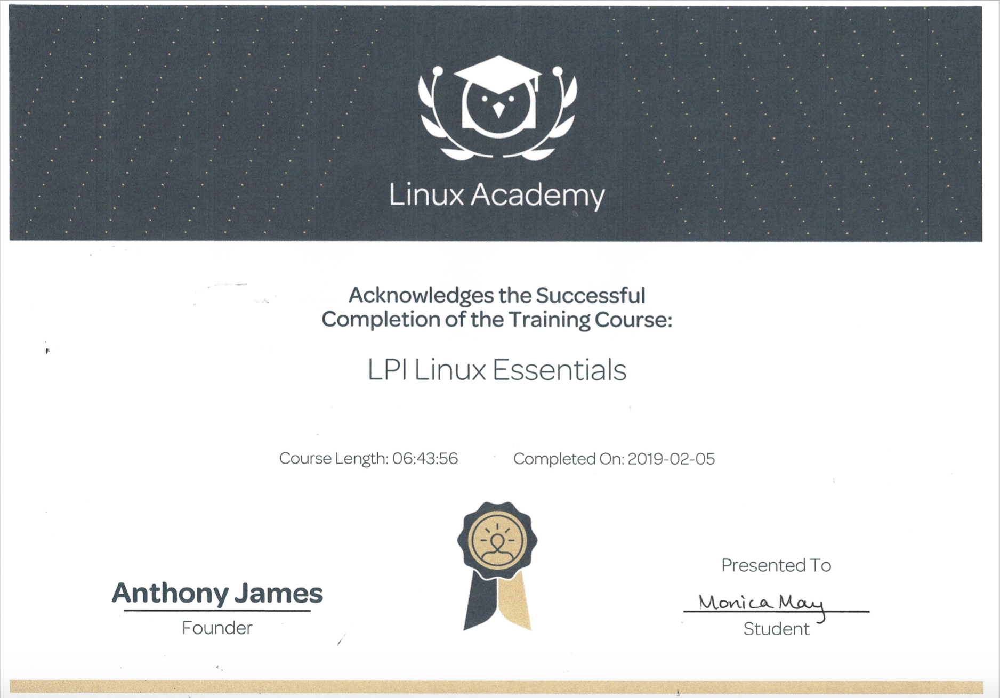

<h1>Technical Skills and Certifications</h1>

Listed below are the technical skills and certifications I acquired as a Computer Information Systems major at The University of Tulsa.

<h2>Technical Skills</h2>

GitHub Learning Lab

 
I completed the following courses in the <a href="https://lab.github.com/courses">GitHub Learning Lab</a>. 
 
  
<h4>Courses:</h4>
<ul>
<li>Introduction to GitHub</li>
<li>Communicating using Markdown</li>
<li>Introduction to HTML</li>
<li>GitHub Pages</li>
<li>Managing merge conflicts</li>
<li>Community Starter Kit</li>
<li>Uploading your project to GitHub</li>
<li>Getting started with GitHub Apps</li>
<li>Migrating your repository to GitHub</li>
<li>Reviewing pull requests</li>
<li>Securing your workflows</li>
<li>Create a release based workflow</li>
</ul>

PowerBI

 
 I auditted the Analyzing and <a href="https://www.edx.org/course/analyzing-and-visualizing-data-with-power-bi-0">Visualizing Data with Power BI</a> course on edX and completed the following courses:
 
  
<h4>Courses:</h4> 
<ul>
<li>Power BI Desktop Data Transformations</li>
<li>Power BI Desktop Modelling</li>
<li>Power BI Desktop Visualization</li>
<li>Power BI Service</li>
<li>Working with Excel</li>
<li>Direct Connectivity</li>
<li>Developer API</li>
<li>Mobile App</li>
</ul>
 

 

PowerShell

 
  
Information about PowerShell

Amazon Web Services (AWS)

 
  
Information about AWS

Linux

 
  I completed the LPI Linux Essentials course on <a href="https://linuxacademy.com/">Linux Academy</a>. 
 
  Throughout the course, I learned about the following topics: 
 
   

<h4>Topics:</h4>
<ul>
<li>The Linux Community and a Career in Open Source</li>
<li>Finding Your Way on a Linux System</li>
<li>The Power of the Command Line</li>
<li>The Linux Operating System</li>
<li>Security and File Permissions</li>
<li>Community Starter Kit</li>
<li>Uploading your project to GitHub</li>
<li>Getting started with GitHub Apps</li>
<li>Migrating your repository to GitHub</li>
<li>Reviewing pull requests</li>
<li>Securing your workflows</li>
<li>Create a release based workflow</li>
</ul>

<h4> Certificate: </h4>
LPI Linux Essentials Course Completion Certificate:

 

 
 
<h2>Certifications</h2>

COMPTIA Security +

 
  
Information about certification

Cybersecurity Fundamentals

 
  
Information about certification

 
